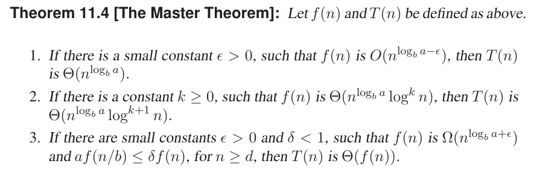
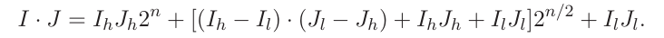
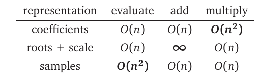

# Divide and Conquer

The divide-and-conquer technique involves solving a particular computational problem by dividing it into one or more subproblems of smaller size, recursively solving each subproblem, and then “merging” or “marrying” the solutions to the subproblem(s) to produce a solution to the original problem.

- **We have a problem $S(n)$ ($n$ is the size of the problem).**

We break it up into $k$ sub-problems $S(n_1),S(n_2),S(n_3)....S(n_k)$ of sizes $n_1,n_2,n_3....n_k$ respectively, solve them recursively and combine their solutions to get the solution of the larger problem $S(n)$

- Merge Sort, Quick Sort, Binary Search etc

Complexity of divide and conquer algorithms is computed using recurrence relations, as we have seen earlier.

## Master Theorem

Master theorem gives a cookbook method of determining the asymptotic characterization of a wide variety of recurrences.

It is used for recurrences of the form:

$T(n) = \begin{cases} c &\text{if} ~n < 1 \\aT(n/b) + f(n)~& n \geq d  \end{cases} $

where $d \geq 1$ is an integer constant and $a \geq 1, b>0, c>0$ are all real constants and $f(n)$ is a function that is positive for $n \geq d$

- Examples

   - $T(n) = 4T(n/2) + n $

       - $a = 4, b = 2, f(n) = n, f(n) = O(n^{log_b(a)}) = O(n^2)$
         Choose $\epsilon = 1$. Case 1 and therefore $T(n) = \Theta(n^2)$
   - $T(n) = 2 T(n) + nlog(n)$  : Case 2
   - $T(n) = T(n/3) + n$ : Case 3

------------------------------------------------------

## Integer Multiplication

- Two big integers $I$ and $J$ of $n$ bits each (assumed a power of $2$)
- $I_h, J_h$ : Corresponding to the higher order bits
- $I_l, J_l$ : Corresponding to the lower order bits

$I.J = (I_h 2^{n/2} + I_l)(J_h 2^{n/2} + J_l) = I_hJ_h 2^n+I_hJ_l2^{n/1}+I_lJ_h2^{n/1}+I_lJ_l$

- $T(n) = \begin{cases} c &\text{if} ~n < 2 \\4T(n/2) + cn ~& n \geq 2  \end{cases} $
  - Solution??

No better than high school grade algorithm

- Let us consider another way of the doing the same.

- $T(n) = \begin{cases} c &\text{if} ~n < 2 \\3T(n/2) + cn ~& n \geq 2  \end{cases} $

  - Solution??  
------------------------------------------------------

## POLYNOMIALS (FROM ALL WE KNOW TO IMPLEMENTATION)

- $p(x) = \sum_{i=0}^{n} a_i x^i $ : $n^{th}$ degree polynomial if $a_n \neq 0 $.

- Polynomials viewed as a programming structure should support the following operations:

  - Evaluation at a point $x$
  - Addition/Subtraction
  - Multiplication

- Before getting into all of them, we have to figure a way to represent them programmatically

    - ### array representing coefficients

      - Example: $3x^4+2x+4$ can be represented as the array  :  [4,2,0,0,3] (The powers increase from left(index 0) end which represents $x^0$)
    - How do we accomplish the operations using this representation?

      - **evaluate($P,x$)**
          
          1. $n = length(P)$ $~~~~~~~~~~~--->1$
          2. $X = 1, sum = 0$ $~~~~~~~~~~--->2$
          3. for $i=0$ to $n-1$:  $~~~~~~~~~~~~~~~~~--->n$
          4.   - $sum=sum + XP[i]$ $---> n $ 
          5.   - $X = X.x$ $---> n $ 
          6. return $sum$ $---> 1 $
          ------------------------------
          Total number of operations : $O(n)$

      - **add($P,Q$)** //Assume both are of the same degree $n$

        - Quite straightforward, simply add the corresponding elements of the two arrays
        (Try writing the pseudo code and compute the run time)
      
      - **multiply($P,Q$)**
         
         - The result of multiplication will have a maximum degree $2n$
         - Coefficient of $x^k$ : $R[k] = \sum_{i=max(0,k-n)}^{min(k,n)}P[i]Q[k-i]; 0 \leq k \leq 2n$.
         - Procedure:

              **multiply($P,Q$)**
                
              1. $R : 2n$ long array
              2. for $i = 0$ to $n-1$:
              3.    - $R[i]=0$
              4. for $j=0$ to $n-1$:
              5.    - for $k=0$ to $n-1$:
              6.         R[j+k] = R[j+k] + P[j]Q[k]
              7. return R

         - Compute the run-time of the operation above program.(Also make sure that the above code routine and the formula for $R[k]$ are in agreement)

------------------------------------------------------
### *Can we do multiply in better run time?*

  - Alternate representations provide clue:

      - Sample representation
      - $n$-degree polynomial needs $n+1$ number of samples
      - $\{(x_0,p(x_0)) (x_1,p(x_1)),(x_2,p(x_2))...(x_n,p(x_n))\}$

      - Performing addition and multiplication in sample domain is easier computationally.

        - Addition : $p,q$ polynomials of degree $n$. 
          
          $\{(x_0,p(x_0)) (x_1,p(x_1)),(x_2,p(x_2))...(x_n,p(x_n))\} + \{(x_0,q(x_0)) (x_1,q(x_1)),(x_2,q(x_2))...(x_n,q(x_n))\} = \{(x_0,p(x_0)+q(x_0)), (x_1,p(x_1)+q(x_1)),(x_2,p(x_2+q(x_2)))...(x_n,p(x_n)+q(x_n))\}$
          (RHS gives sample representation for the polynomial sum)

        - Mutlplication : Since the product needs $2n+1$ coefficients sample each poly at $2n+1$ points and then perform sample wise multiplication

          $\{(x_0,p(x_0)) (x_1,p(x_1)),(x_2,p(x_2))...(x_n,p(x_2n))\} + \{(x_0,q(x_0)) (x_1,q(x_1)),(x_2,q(x_2))...(x_n,q(x_2n))\} = \{(x_0,p(x_0)q(x_0)), (x_1,p(x_1)q(x_1)),(x_2,p(x_2)q(x_2)))...(x_n,p(x_n)q(x_n))\}$

       - Addition and multiplication can be done in $O(n)$ time

       - Evaluation : It is a problem of interpolations where you have to interpolate to a find the value at point $x$ tgiven the polynomial values at $\{x_0,x_1...x_n \}$. You can use interpolation formula but that at best can make it $O(n^2)$

       ### What is Situation Now?
          
      
     (Root and Scale you can ignore as they are seldom used)
--------------------------------------

A nice scheme for multiplication given coefficient representation is to convert it to convert it to sample representation and perform multiplication on sample reprentation. Then convert the result back to coeff representation.

- Conversion of coeff representation to a general sample representation takes a total of $O(n^2)$ in total. (It takes $O(n)$ time for computing one sample)

- The above scheme won't work if this is the case ( Complexity will continue to be $O(n^2)$)

**!!!!SOLUTION!!!!**

Rather look for a peculiar set of samples which support faster to and fro conversion.

- Look at a polynomial (from now on for simplicity sake assume that the degree $n$ is $2^k-1$ for some $k$, Eg $n = 7,15 ...$

   $p(x) = \sum_{i=0}^{n} a_i x^i \\~~~~~~~~ = \sum_{i=even} a_j x^j + \sum_{k = odd} a_kx^k \\~~~~~~~~ = p_{even}(x^2)+xp_{odd}(x^2)$ 

where 

   $p_{even}(y) = $ Terms in $p(x)$ with even powers for $x$

   $p_{odd}(y) = $ Terms in $p(x)$ with odd powers for $x$ with one $x$ removed from each term.

   E.g.

   $p(x) = 10x^7+5x^6+22x^5+11x^4+13x^3+1x^2+4x^1+21$

  $p_{even}(y) = 5y^3+11y^2+1y^1+21$
  $p_{odd}(y) = 10y^3+22y^2+13y^1+4$

  Check whether $p(x) = p_{even}(x^2)+xp_{odd}(x^2)$ holds.

  

      

    

