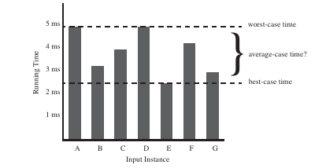
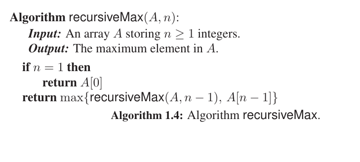
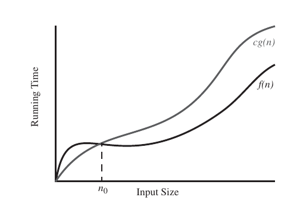

# Introduction to Analysis of Algorithms

- Analyse the space and time requirements of algorithms
- Learn the broad themes and design principles involved
- The primary stress is on the computational efficiency - we want algorithms that run quickly
- The algorithms should be scalable too. (It should be able to cope with large input volumes)
- We need a language and a frame work to describe algorithms (And possibly discuss them over a cup of tea! )
----------------------------------------------

The problem is that running time is a difficult thing to characterize if you look at it closely. There are a huge number of factors that can decide the running time of an algorithm.

- Input size
- Software environment (OS, programming language, compiler .....)
- Hardware environment (processor, clock speed, memory, disk ....)
-----------------------------------------------------

We learn an analytical framework that :
- Takes into account all possible inputs
- Evaluate relative efficiency of any two algorithms in way that is indpendent of the hardware and software environment
- Can be performed by studying a high-level description of the algorithm without implementing it.

The framework shall consist of 

1. A language for describing algorithms
2. A computational model that the algorithm executes within
3. A metric for measuring running time
4. An approach for characterizing running times including those for recursive algorithms.

## Language

- Pseudo-code : A mix of programming and natural languages. 
Should be rich enough to describe an algorithm at a high level

Running times are computed on pseudo-codes rather than on actual programs

## Computational Model

- Random Access Model (RAM model)

    CPU <=> Memory

    Memory is a bank of cells each capable of storing a word. (No limit on the size of a word. $10^{400}$ can be stored there ) 

    CPU can access an arbitrary cell in a constant time

- Primitive Operations 

   There are a set of primitive operations that the model can perform:

   1. Assignment of a value to a variable
   2. Calling a function
   3. Arithmetic operations
   4. Comparison of two numbers
   5. Array indexing
   6. Following an object reference
   7. Returning from a method

   CPU can perform any primitive operation in a constant amount of time (constant number of steps) independent of the input size.

### Running Time 

Running time is defined as the total number of primitive operations that are performed by an algorithm.

This is a faithful surrogate of the actual running time as the vast experimentations have time and again proved. 

----------------------------------------------------------

Having agreed on what running time is and seen it in practice let us now investigate its precise relation with the input size.

For the same input size (say $n$) different inputs may take different running times (as we have seen in the example above)

Therefore it makes sense to raise the question :

***"What running time does the algorithm take for a given size $n$ on an average?"***

A nice question....but 

Pretty hard to do....because we do not know the distribution of the input. (Computing the expected time is out of question)

By the way this is called "*Average Case Running Time*"

The usual practice is to judge algorithms on the basis of its worst case running time.

It is the input case which takes the maximum number of primitive operations for a given size $n$

(Acceptance of worst case as the bench mark of running time is premised on the expectation that an algorithm that performs well in the worst case, will not disappoint us in other cases)

### Counting the number of operations in the worst case for recursive algorithms

- Recursive procedures call itself
- There is a base case which is simple enough to be solved directly without recursion
- Use recursion to formulate an expression for the complexity of recursive functions

$T(n) = \begin{cases} 3 &\text{if} ~n = 1 \\T(n-1) + 7 &\text{otherwise} \end{cases} $

----------------------------------------------

## Asymptotic Notations

 - Till now we have been laboriously computing the exact count of the primitive operations perfmormed by an algorithm. 
 - We can simplify things if we restrict ourselves to counting the steps of the pseudo-code or the high-level language involved. This estimates the number of primitive operations upto a constant factor.

 - We use a notation that allows us to characterize the main factors that affect an algorithm's running time without going into the details of exactly how many primitive operations are performed for each constant-time set of instructions.

 ### The "Big-Oh" notation
 Let $f(n)$ and $g(n)$ be functions from $N \rightarrow \Re$ 

 We say that $f(n) = O(g(n)) $ if there is a real constant $c>0$ and an $n_0 \in N$ such that $f(n) \leq cg(n)~ \forall n \geq n_0 $.

 (Pronounced as $f(n)$ is big-oh of $g(n)$)

### The "Big-Omega" notation

 Let $f(n)$ and $g(n)$ be functions from $N \rightarrow \Re$ 

 We say that $f(n) = \Omega(g(n)) $ if there is a real constant $c>0$ and an $n_0 \in N$ such that $f(n) \geq cg(n)~ \forall n \geq n_0 $.

### The "Big-Theta" notation

 Let $f(n)$ and $g(n)$ be functions from $N \rightarrow \Re$ 
 We say that $f(n) = \Theta(g(n))$ if $f(n) = O(g(n)) \text{and} f(n) = \Omega(g(n)) $ 

 This means that there are real number constants $c$,$c'$ and integer constant $n_0$ such that $cf(n) \leq g(n) \leq c'f(n) \forall n \geq n_0$

----------------------------------------------------------

